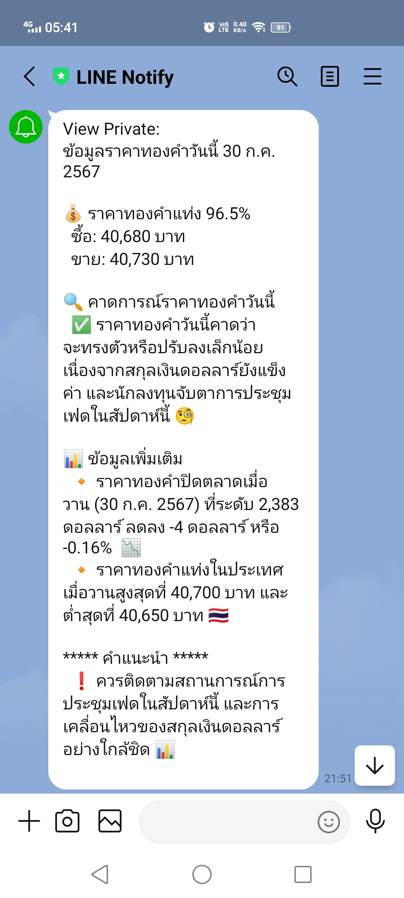

## Gold Price AI Service

This service leverages the power of artificial intelligence (AI), specifically utilizing the Langchain library, to predict gold prices in Thailand, focusing on the 96.5% gold bar. By combining web scraping and AI analysis, it empowers traders and investors with valuable insights.




**Features:**

* **AI-Powered Gold Price Prediction:** Employing advanced AI algorithms, the service analyzes historical data and market trends to predict the most likely future prices for 96.5% gold bars in Thailand.
* **Data-Driven Insights:** The service meticulously scrapes gold price information from reliable web sources, ensuring AI models are trained on comprehensive and up-to-date data.
* **AI-Generated Market Summaries:** Beyond prediction, the service employs AI to intelligently summarize market movements and key factors influencing gold prices, offering valuable context to your investment decisions.
* **Line Notify Integration:** Receive timely notifications about significant price changes, market summaries, and predictions directly to your Line app for quick decision-making.

**Setup:**

To utilize this service, you'll need to acquire API keys from the following providers:

* **Gemini AI:** Obtain your API key from [https://aistudio.google.com/app/apikey](https://aistudio.google.com/app/apikey). Gemini AI provides the essential AI infrastructure for training and using our prediction models.
* **Serp API (Optional):** If you wish to integrate web scraping functionalities for real-time data acquisition, procure an API key from [https://serpapi.com/dashboard](https://serpapi.com/dashboard).

**Output:**
 - Teminal
 - Line Notify

**Installation:**

1. Clone this repository.
2. Install required dependencies: `npm install`
3. Configure your API keys in the appropriate environment variables in /config folder.

**Usage:**

1. Run the `npm start` script (or equivalent script in your project).
2. The service will automatically scrape data (if using Serp API), analyze it using AI, and present the predicted gold price along with supporting summaries.
3. Setup a cron job to run the scrip periodically.


**Usage in Docker:**
1. Build the image
```
  docker build -t goldpriceai:latest .
```

2. Running the Image
Please find the variable name in config/env.example
```
  docker run -e VARIABLE_NAME=value -p 8888:8888 goldpriceai:latest
```

**Setup cronjob:**
1. Edit Crontab:
```
crontab -e
```

2. Add Cron Job Entry: run script /opt/app/runscript.sh on Mon to Sat at 9am and 5pm

```
0 9,17 * * 1-6 /opt/app/runscript.sh
```

3. Testing Your Cron Job (Optional):
```
crontab -l | crontab -
```
