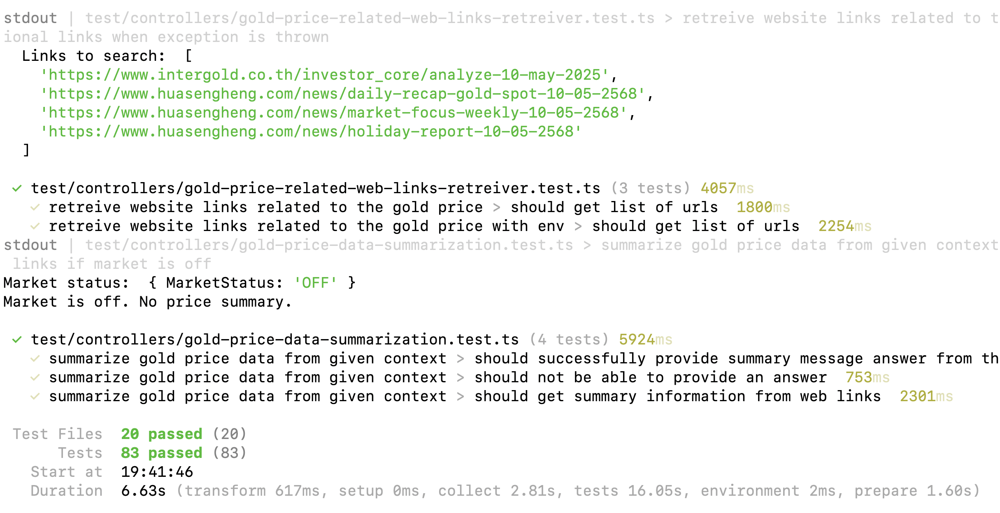
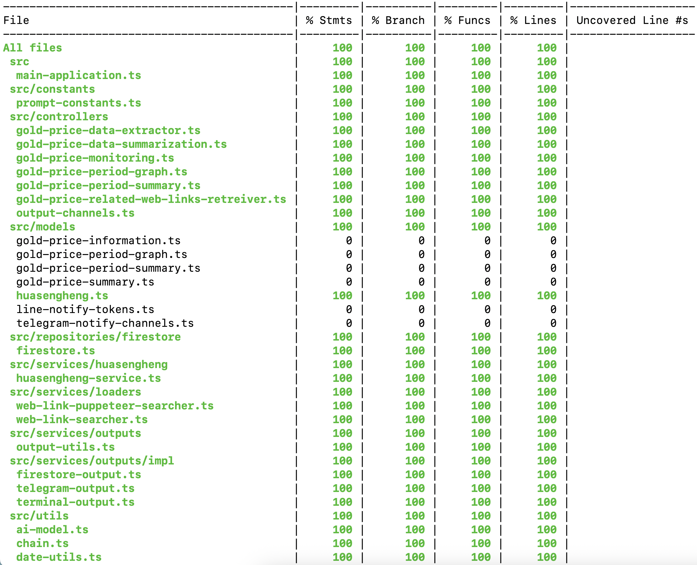

## Gold Price AI Service

This service leverages the power of artificial intelligence (AI), specifically utilizing the Langchain library, to predict gold prices in Thailand, focusing on the 96.5% gold bar. By combining web scraping and AI analysis, it empowers traders and investors with valuable insights.

Additionally, the system offers real-time price monitoring, providing instant notifications when gold prices fluctuate beyond user-defined thresholds. This feature enables users to make informed decisions and seize opportunities effectively.

- **Example:**


Summary<br/>

<br/>
<br/>

Price monitoring<br/>

<br/>
<br/>

Weekly Summary<br/>

<br/>
<br/>

Gold Price Chart for daily, weekly, monthly and yearly report<br>


<br/>
<br/>
<br/>

**Features:**

- **AI-Powered Gold Price Prediction:** Employing advanced AI algorithms, the service analyzes historical data and market trends to predict the most likely future prices for 96.5% gold bars in Thailand.
- **Data-Driven Insights:** The service meticulously scrapes gold price information from reliable web sources, ensuring AI models are trained on comprehensive and up-to-date data.
- **AI-Generated Market Summaries:** Beyond prediction, the service employs AI to intelligently summarize market movements and key factors influencing gold prices, offering valuable context to your investment decisions.

- **Price Monitoring:** The system provides real-time alerts when gold prices change significantly, helping users make timely decisions.

- **Gold Price Chart:** View the historical gold price chart to easily analyze past performance and see the current price status at a glance.

- **Telegram Integration:** Receive timely notifications about significant price changes, market summaries, and predictions directly to your Telegram app for quick decision-making.

**Setup:**

To utilize this service, you'll need to acquire API keys from the following providers:

- **Gemini AI:** Obtain your API key from [https://aistudio.google.com/app/apikey](https://aistudio.google.com/app/apikey). Gemini AI provides the essential AI infrastructure for training and using our prediction models.
- **Serp API (Optional):** If you wish to integrate web scraping functionalities for real-time data acquisition, procure an API key from [https://serpapi.com/dashboard](https://serpapi.com/dashboard).

**Output:**

- Teminal
- Telegram
- Firestore - to persist the summary and price data

**Installation:**

1. Clone this repository.
2. Install required dependencies: `bun install`
3. Configure your API keys in the appropriate environment variables in /config folder.

**Usage:**

### Single run

1. Run the `bun start` script (or equivalent script in your project).
2. The service will automatically scrape data (if using Serp API), analyze it using AI, and present the predicted gold price along with supporting summaries.

### Start with cron

1. Setup the variable name as shown in config/env.example
   For example

```
  export GOOGLE_API_KEY="get the key from https://aistudio.google.com/app/apikey"
  export GOOGLE_AI_MODEL="gemini-1.5-flash"
```

2. Run the `bun run start-cron` to start the service as a cron job

**Usage in Docker:**

1. Build the image

```
  docker build -t goldpriceai:latest .
```

2. Running the Image
   Please find the variable name in config/env.example

```
  docker run -e VARIABLE_NAME=value -p 8888:8888 goldpriceai:latest
```

**Setup cronjob:**

1. Update the environment variable CRON_SUMMARY_SCHEDULE and CRON_MONITOR_PRICE

2. By default it runs on Mon to Sat at 9am and 5pm

3. Setup the price threshold

```
0 9,12,17,21 * * 1-6 /opt/app/runscript.sh
```

**Tests with Vitest:**
Test with Vitest framework





Deployment

1. Push the image to docker hub

```
docker tag goldpriceaiservice vokmon/goldpriceaiservice:latest
docker push vokmon/goldpriceaiservice:latest
```

**Setup Firestore admin**

## The firestore rule policy should be kept as

```
rules_version = '2';

service cloud.firestore {
  match /databases/{database}/documents {
    match /{document=**} {
      allow read, write: if false;
    }
  }
}
```

## Create service account by

- Go to Project Settings
- Select Service accounts tab
- Select Firebase Admin SDK
- Click Generate new private key

**Setup Superbase for storing price data**
Supabase will only be used for storing data. This helps keep the process separate from the database.

- Supabase Edge Functions have limitations (like execution time limits) preventing us from running certain processes. https://supabase.com/docs/guides/functions/limits
- This includes tasks like long-running web scraping that requires tools like Puppeteer/Chromium, which aren't supported in Edge Functions.
- To avoid splitting our backend logic across different platforms, we chose to use Supabase solely for data storage and keep all processing together elsewhere.

projectname: goldpriceaiservice
username: goldpriceaiservice
